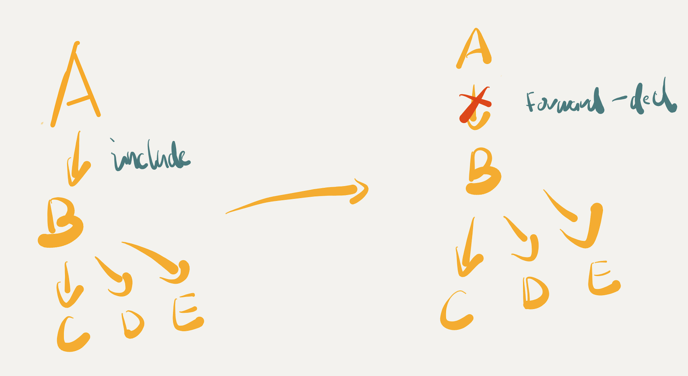

One major pain point of working with C++ is that if the project is large enough then eventually the compile time will catch up on you and slow you down. The feedback loop from writing code to actually being able to test it and then reiterate is cluttered by long waiting time. Remember this XKCD meme?


There are a few common tricks to speed up compilation. I want to go through two specific ones I know and try to explain my understanding why they are useful, and try to summarise the common traits among these two techniques. Before that I want to mention that there is a famous book [Large-Scale C++ Software Design](https://www.amazon.co.uk/Large-Scale-C-Software-Design-APC/dp/0201633620), that also touched upon this topic. I have not read this book so maybe I am just repeating what’s been already said before. But these thoughts are from my own experience so I want to write it down as a learning reference.

# Build and rebuild time

I want to first make a distinction between build time and rebuild time. By build time I mean to build everything from scratch.

On the other hand, rebuild time means I have already built the project and after modifying some `.cpp` or `.hpp` file I need to recompile the project to test it.

As a developer, I care far more about the rebuild time. This is the most usual type of build I will encounter. But the time to rebuild is not only determined by the compiler you are using. Usually it also depends on how smart your build system is. As for C++, this can vary a lot from simple make file to complex tools like [bazel](https://bazel.build/) or [buck](https://buck.build/) (or ninja, cmake etc). Nonetheless, the tricks mentioned below is generally applicable enough so I would not make any assumption what build system you are using.

# Forward Declaration

The first one is forward declaration. Note, I want to emphasis that faster compilation **is not** the sole purpose of forward declaration, there are other occasion where this technique is useful. But an effect of applying forward declaration is that it _can_ potentially make your build time faster.

So what is forward declaration? A minimal example looks like this:

```cpp
// B.h
#include <A.h>

class B {
	void doSomething(const A& a);
}
```

So instead of including `A.h`, we do something like this:

```diff
// B.h
- #include <A.h>
+ class A;
class B {
	void doSomething(const A& a);
};
```

So you “forward declare” `class A` instead of including it from `A.h` .

How does this save on building time? One lazy explanation is that since we are not including `A.h` the compiler does not need to read it, parse it and manipulate the AST to generate machine code for it.

This is the wrong explanation. First in most cases, you still need to include `A.h` in `B.cpp` as you need a full type to do anything meaningful for/to A.

So why do people say this helps saving time on compilation? The answer is this technique helps on rebuild time. Say if we have another class, C which rely on B but not on A.

```cpp
// C.h
#include <B.h>

class C {
	// code using a full type B
};
```

Let’s assume that C needs B’s full information so it has to include `B.h` . What happens if we made some change to class B? For example adding a method to it or adding some new data member? In this case the build system are forced to recompile C because B’s interface and potentially its layout changed. So if B has a direct import of A, then this “code change → recompile” trigger will be pushed every time we change `A.h` as well but if we forward declare A in B then it won’t. As it turns out in a project with hundreds of classes and files, breaking up some dependencies can actually save a lot of re-compilation.



# Pimpl

[Pointer to implementation](https://en.cppreference.com/w/cpp/language/pimpl) is another common technique used to 1) make the ABI stable and 2) reduce compilation time. I will not dwell into too much detail here as the `cppreference` link has more than enough information one can chew on.

```cpp
// --------------------
// interface (widget.h)
class widget
{
    // public members
private:
    struct impl; // forward declaration of the implementation class
    // One implementation example: see below for other design options and trade-offs
    std::experimental::propagate_const< // const-forwarding pointer wrapper
        std::unique_ptr<                // unique-ownership opaque pointer
            impl>> pImpl;               // to the forward-declared implementation class
};

// ---------------------------
// implementation (widget.cpp)
struct widget::impl
{
    // implementation details
};
```

Here is my theory on why this method can save on **rebuild** time. Since the header now is only the pure interface, any implementation change in the cpp file will not trigger an interface change (unless you actually changed the interface). So any implementation change will not trigger other classes to be recompiled.

# Common traits

So what can we learn from these two techniques, I think on the surface these two techniques seems almost unrelated but if we look at them in more depth they are just renderings of more general Software Engineering principles:

1. keep your interface clean, well thought-of so that you do not need to change them often
2. keep your dependencies minimal, if you do not need to know the full type of something, then a forward declaration is enough. Always favor tight dependencies over loose ones. (Think of the advice to not `from module_a import *` in Python).

I am quite curious to see if we go from these principles, could we derive more useful techniques to make rebuild faster?

# Bonus thoughts

Looking at these two techniques together, I am wondering if C++ has a fundamentally too simple solution to the “interface/implementation” problem. Other compiled language seems to all adopt modules (see 2 in Acknowledgement). Gladly C++ 20 introduced modules. Although it has not been widely adopted yet this might give us a chance to get away from using includes, which are simply text replacement. I will try find more about modules and make another post some time.

# Acknowledgement

1. When trying to understand more about forward declaration I sought help on SO:
   1. [https://stackoverflow.com/questions/73586567/how-does-forward-declaration-save-compile-time](https://stackoverflow.com/questions/73586567/how-does-forward-declaration-save-compile-time)
2. Modules in other languages
   1. [https://go.dev/blog/using-go-modules](https://www.notion.so/Theory-about-C-compile-time-f2df4cd1dea043309f849299077a2170)
   2. [https://www.oracle.com/uk/corporate/features/understanding-java-9-modules.html](https://www.oracle.com/uk/corporate/features/understanding-java-9-modules.html)
   3. [https://doc.rust-lang.org/rust-by-example/mod.html](https://doc.rust-lang.org/rust-by-example/mod.html)
   4. [https://ocaml.org/docs/modules](https://ocaml.org/docs/modules)
