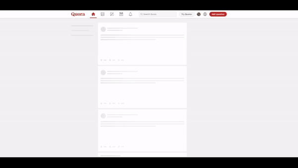

这是我vlog的文字稿，vlog可以在这里观看：[https://www.youtube.com/watch?v=eoJUmM7O8-A](https://www.youtube.com/watch?v=eoJUmM7O8-A)


# 开场

大家好，之前因为一些个人原因，一直没能及时更新这个频道。最近生活逐渐稳定下来。终于有时间来跟大家讲一讲我一直很关注的一个业界趋势了。
在我刚开始工作的时候，大概是15-16年，初出茅庐的我注意到工业界慢慢掀起了一场关于async programming（也就是我们中文中所说的异步编程）的革命。到现在为止，我自己所常用的语言已经都有了相对成熟的异步编程的解决方案。

我经常看到有些同学，特别是转码和刚工作的朋友，在这方面了解不深，不能完全理解异步编程的动机，适用范围和使用方法。所以我想开一个新坑，专门聊聊这方面的话题。主要会包括：异步编程是什么，为了什么，怎么用，以及最后可能会深入讲一讲背后的实现原理。但是我不会把这个系列做成只讲异步编程的专题，而是会在讲异步编程的时候顺便带一些其他的相关概念，这也是我自己对知识的一个梳理。

今天这期，我们先抛开那些关于异步编程的晦涩难懂的名词，来聊聊为什么我们要用异步编程。

# Blocked IO and scalability

让我们回到2007年，也就是iPhone发布的那一年，随着web2.0和移动互联网的出现，越来越多的应用程序从简单的单机程序变成了需要和远端服务器进行通讯的客户端程序。在这个大的时代背景下，人们逐渐意识到大多数程序的瓶颈在与IO。为什么这么说呢？让我们先来看几个例子：

* 读取一个文件，相信大家都写过和图里类似的code，从文件中读取一些数据到内存中进行处理，大家一般会注意到如果文件越大，那么这段代码执行的时间会越长。而且程序会在readlines这里暂停，后面的code会只有在readlines结束后才运行
  
  ```python
  with open('readme.txt') as f:
      lines = f.readlines()
  ```

* 第二个例子：一个TCP的echo server, 我们用Python的socket library来监听一个端口，然后持续的接受新的信息，并把这个信息写回给客户端。大家可以注意到，这个程序会在两个地方暂停，一个是接受数据的地方，我们会1）等待客户端发送数据；2）因为linux的架构，我们接收到数据后需要把数据从内核空间拷贝到用户空间。在发送时也需要做相反的工作 -- 把数据从用户空间拷贝到内核空间，并等待网卡把我们的数据发送出去。所有的这些操作都会造成程序”空转“，在程序进行IO的时候我们的CPU其实没有利用起来，而是在等待IO操作的完成。
  
  ```python
  #!/usr/bin/env python3
  
  import socket
  
  HOST = '127.0.0.1'  # Standard loopback interface address (localhost)
  PORT = 65432        # Port to listen on (non-privileged ports are > 1023)
  
  with socket.socket(socket.AF_INET, socket.SOCK_STREAM) as s:
      s.bind((HOST, PORT))
      s.listen()
      conn, addr = s.accept()
      with conn:
          print('Connected by', addr)
          while True:
              data = conn.recv(1024)
              if not data:
                  break
              conn.sendall(data)
  ```

IO会暂时中断程序运行，这一个特性，给我们的客户端和服务端开发都带来了挑战。

## 客户端

在客户端，如果应用程序需要在获取远端数据时暂停执行，那么很可能这个暂停会影响到程序界面的渲染。我们拿一个简单的blog网站举例，网站在渲染过程中，我们有时候需要从服务器获取图片，或者通过一些API拿到渲染网站UI需要的数据。如果我们的程序需要在所有的IO处等待，用户将不能看到一个流畅的网站渲染过程。比如这里，如果页面在获取我的头像时卡住，那么后面的博客列表将不能及时显示给用户，用户必须等待我的头像出现后才能看到博客列表，这样的用户体验并不是最优的。


大部分的现代应用程序的渲染都采取这样一种策略，就是无论现在客户端有什么数据，都先渲染已经可以渲染的部分，其他部分可以用占位符代替，同时程序会异步请求需要完整渲染页面的数据，然后在数据到来后重新渲染之前用占位符替代的部分。

我们这里可以看一下知名网站Quora的渲染慢放，可以注意到网站一开始是只有一个大的框架的，浏览器在渲染页面的过程中可以同时异步获取数据，等获取数据成功后才把相对应的网页部件重新进行渲染。这样的网页设计是相对更responsive的，能提供比等待所有数据加载后然后一次性渲染网页给用户更好的体验。



聪明的小伙伴肯定已经发现了，在这里我们运用异步编程时，其实是为了实现所谓的“concurrency”，就是当使用异步编程时我们的程序能在同一时间内其实在同时做着几件不同的事情。比如还是回到网页页面渲染的例子，在不使用异步编程的时候，我们的code需要先获取所有需要的数据，然后渲染整个页面。但是如果我们正确的使用了异步编程，可以达到程序同时请求三个不同组件的数据，然后分别渲染每个组件的效果，大大减小了用户看到第一个渲染出来的UI的时间。其实这和我们日常生活中的道理是类似的，我们不会在等外卖的时候只等外卖，而是会看书，学习，打打游戏。而浏览器也不应该在等待数据时空闲，我们的程序应该能够在等待其他组件的数据返回时渲染已经可以渲染的组件。

## 服务端

```python
from flask import Flask
from db import get_data_from_db

app = Flask(__name__)


@app.route('/')
def hello():
    data = get_data_from_db()
    return data
```


在服务端我们面临着类似的情况。相信很多小伙伴也都写过类似的程序（这里用Flask举例），如图中所示的程序，它在处理http request时的流程是：

* 先接受从客户端发来的http请求

* 根据request到db里面取得相应的数据

* 把数据返回给用户

那么如果在程序正在处理第一个请求时，同时有另一位用户发出另一个请求呢？不难看出，因为我们的程序是没有任何concurrency的，那么请求2只有等待请求1彻底执行完后才能开始被处理。这无疑增加了用户2的等待时间，带给用户的是不友好的用户体验，这是不可以接受的。

但是如果我们仔细分析，在我们的程序和数据库进行IO的时候，其实我们的程序会因为等待数据库返回数据进行同步IO而暂停。这个时间是不是可以利用起来处理请求2呢？答案是可以的，只要我们能够正确的使用异步编程，那么我们的服务端程序也可以实现concurrency，同时处理多个请求。

# 总结

相信小伙伴们到这里已经大概有些朦胧的感觉，知道异步编程是为了解决同步IO带来的挑战而出现的一种新的编程模式，但是我知道一定会有小伙伴更疑惑了：

* 当我们平时讨论concurrency的时候，不是一般都在讨论进程（也就是我们所说的process）和线程（thread）么？为什么异步编程也在讨论concurrency？这些concurrency之间有什么区别？

* 异步编程到底是怎么在底层实现的？我们怎么知道什么时候要用异步编程？为什么我在网络上看到谈论异步编程时会谈到libuv，select和epoll？它们到底是什么？

* 异步编程里为什么会有协程这个概念？协程有几种？我们用的协程是哪一种？

* 都说异步编程是有传染性的，那么这种传染性体现在什么地方？对我们的code会造成什么样的影响？

* Go也是用异步编程么?

这些问题，我都会在后面的视频中一一解答。敬请期待。但是在我们离开这个视频前，我想现就后面的内容做一些说明:

1. 视频会以用Python展示为主，间或会用一些C，Javascript或者其他比较典型的语言来说明举例。使用Python的主要原因是因为Python的code一般比较直观，更容易懂，但是Python也有不适合用来说明异步编程的地方，比如Python里既有thread 又有subprocess，还有async/await，更要命的是Python还有个GIL作怪，所以有些时候我们可能会用其他一些语言辅助。需要用到C来展示system call的时候，我会展示一些C的code。
2. 这个系列形式会比较散，我想更多的讨论不同情况下不同技术选择带来的trade off，以及不同技术后面的实现原理。所以我不会讲太高深的异步编程技巧，而是专注用我们最基本的一些计算机科学的概念来还原业界从同步IO到异步IO这个变化潮流的始末，让我们的小伙伴更好地理解异步编程带来的好处，希望能给大家在实际工作中带来便利。

谢谢大家收看！我们下期见！
