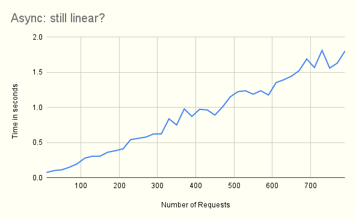
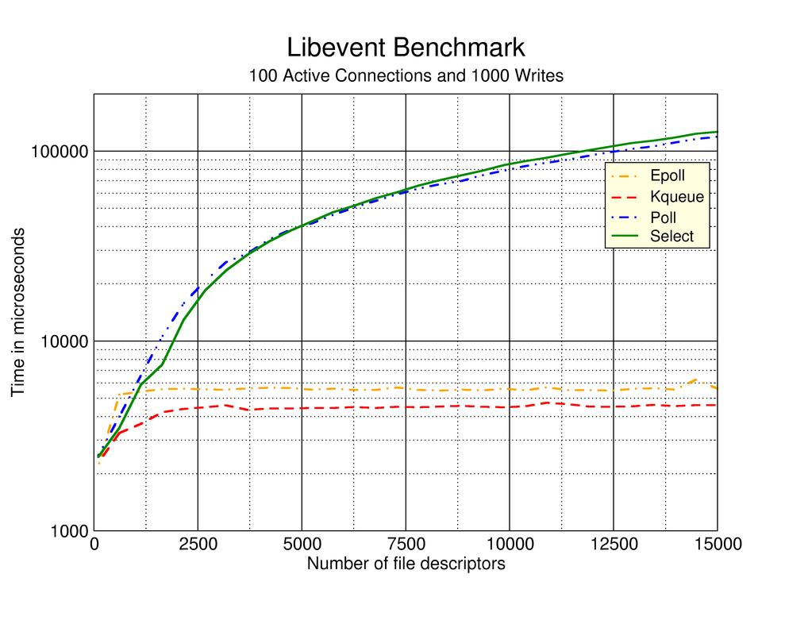

> TL;DR: Python asyncio is about 3.5 times faster than threading. Golang is very performant and has better scalability. It is curious to see why.

In recent years we have seen the rise of async programming in mainstream programming languages. Constructs like `promises`, `async/await,` and `coroutines` can now be found in `Javascript`, `Python` and even good old `C++`. As we all know, this is a side effect of another trend -- more and more applications now rely on network IO, and IO takes time. Instead of wasting your precious CPU cycles waiting for the servers to get back to you, it is wiser to continue other essential tasks, like UI rendering, and resume what you were doing when the data is available.


Lately, I have been working on a project suitable for applying async programming. Part of the requirement of this project is to query a list of HTTP endpoints simultaneously, get the responses and combine them to produce the result. I think this use case is a good playground for demonstrating the usefulness of async programming. Moreover, it would be interesting to test different programming languages' choices of async primitives and their implementation to see how well they perform in real-world scenarios. The main metrics I concern myself most are 1) the ergonomics of using these async programming primitives and 2) the performance gain we get from using async programming in these languages.

# Python

## Threads?

As a long time user, the first language that comes to my mind is Python. Traditionally, Python has limited concurrency support. It has a `threading` library, but in Python, there should be only one thread running at each given time because of the Global Interpreter Lock (GIL), thus limiting the usefulness of threads [^1]. Python also has a `multiprocessing` module in the standard library. However, its drawback is that it forces the programmers to deal with Inter-Process Communication (IPC) — the default choice is too restricting (pickles). 

Even if Python had good support of threading and (sub)processes, I am not too keen to use them because they are often too low-level to be helpful. You need to handle communication and synchronisation. Threads/processes are system-level resources, so proper clean up is always required, adding unnecessary complexity to application code. Plus, compared to other concurrency models like coroutines, threads and processes are more always more expensive -- they consume more memory and are slower to start.

## Asyncio!

Fortunately, from Python 3.6 on, we have the new `asyncio` standard library baked into the language [^2]. 


Let's demonstrate the benefits of async programming by walking through an example: I want to get a list of Pokemon's names through the Pokemon API. Here is how I would do it in traditional Python:

```python
BASE_URL = "https://pokeapi.co/api/v2/pokemon/"
result = []
for i in range(1, number+1):
    r = httpx.get(BASE_URL + str(i))
    result.append(r)
        jsons = []
for r in result:
    try:
        jsons.append(r.json())
    except json.decoder.JSONDecodeError:
        print(r.text)
print(f"Got {len(jsons)} pokemons")
```

The above code is easy to understand; the only thing to notice here is that `http.get` is synchronous. Python interpreter will block further execution if the HTTP client has not got a response. Time, your precious time, is wasted!

Below code achieves the same effect, but using `asyncio`:

```python
async def get_pokemons(number: int):
    tasks = []

    async with httpx.AsyncClient() as client:
        for i in range(1, number+1):
            r = client.get(BASE_URL + str(i))
            tasks.append(r)
        result = await asyncio.gather(*tasks)

    return result

result = asyncio.run(get_pokemons(number))
jsons = []
for r in result:
    try:
        jsons.append(r.json())
    except json.decoder.JSONDecodeError:
        print(r.text)
```

Admittedly, the code becomes slightly more complex. But we programmers know we must pay a little bit price for concurrency, right? Compared to the [threading version](https://github.com/bobfang1992/async-test/blob/master/async.py#L55-L77)[^3], which is the "old" way of achieving concurrency,  the `asyncio` code is very readable -- it hides details an application developer does not care about.

So how does `asyncio` perform? 


It is no doubt that the sync and wait version is slow, but what this graph does not tell you is that the threading pool version is much slower than the async one; let's zoom in a little bit:


And plotting for only `asyncio`:



In general, even when using multi-threading in Python, getting all the responses we need is slower by 3.5 times than using `asyncio`. This might be unintuitive, as `asyncio` uses only one thread. But as mentioned previously, the GIL is playing a role here, so there is no concurrency, although we have multiple threads. In contrast, in `asyncio`, the concurrency is achieved through OS-provided [IO multiplexing](https://wiki.c2.com/?IoMultiplexing) -- a single thread can wait on multiple IO events simultaneously using the `epoll` system call and schedule its work using an event loop.

But I am not satisfied. Although `asyncio` is faster, if we look at the blue line, the total time to get all the response has a linear relationship with the number of requests we sent. My theory was that when using `asyncio`, since the GIL does not bound us, we simultaneously established many TCP connections to the server.  Assuming the server itself is concurrent, we should get all the responses back at an almost identical time. Thus the blue line's slope should not be that obvious.

---


<center><i>Like sprinters racing to cross the finish line, our HTTP responses should arrive at almost the same time.</i></center>

---

Somehow this is not the case. I have several theories, but none of them can fully explain this issue at this moment. 

But what about other languages? Do their implementation of `asyncio` suffer the same issue?

# Golang

A Golang implementation of the same idea we use in Python looks


Note that in `Golang`, we do not have the concept of a coroutine; goroutine is a special primitive that can only be found in Golang. The code here may give you the impression that function `getPokemon` seems to be running in a thread, but there are two essential things to remember:

* goroutines are [green threads](https://en.wikipedia.org/wiki/Green_threads); they are not OS-level threads, so they are cheaper to launch
* HTTP or any networking IO calls in Golang is async,  but Golang has made them look synchronous to be easily used in goroutines [^4].

Let's look at the performance:


Ignoring the apparent outliers, we can see that the line is almost flat. This is what I have expected, and it shows that Golang's implementation has better scalability than Python when using async IO. 

Also, to note: the y-axis's unit for Golang is milliseconds, not seconds, and the x-axis's maximum value is almost 1600, twice as many as Python's. Compared to Python, Golang is much faster.

# Food for thought

Given that we know that `Golang` and `Python` are all using `epoll` internally for IO multiplexing, and we understand from `libevent`'s benchmark below that `epoll` has an almost O(1) scalability. `Python`'s linear scalability seems rather strange and suggests that `asyncio` has some optimisation awaiting.



---

> Special thanks for [Pokemon API](https://pokeapi.co/). I have spaced out my experiments, so it should be well in the range of their fair use policy's tolerance. 

[^1]: Some C extensions can bypass the GIL, but they are not relevant to our discussion. 
[^2]: The Python community had numerous previous attempts to fit async programming into the languages with third-party libraries, like `twisted` or `tornado`. But I came to the part too late; my only exposure to async in Python is via newer iterations like `asyncio` or `trio`.
[^3]: Here, we use `concurrent.futures` to automatically handle creating and joining threads. So the code already reads better than a pure `threading` implementation but still falls behind the `asyncio` version.

[^4]: See the explanation here for more details: https://morsmachine.dk/netpoller
