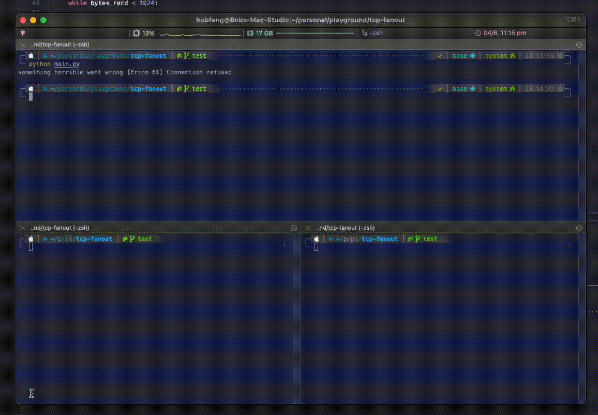
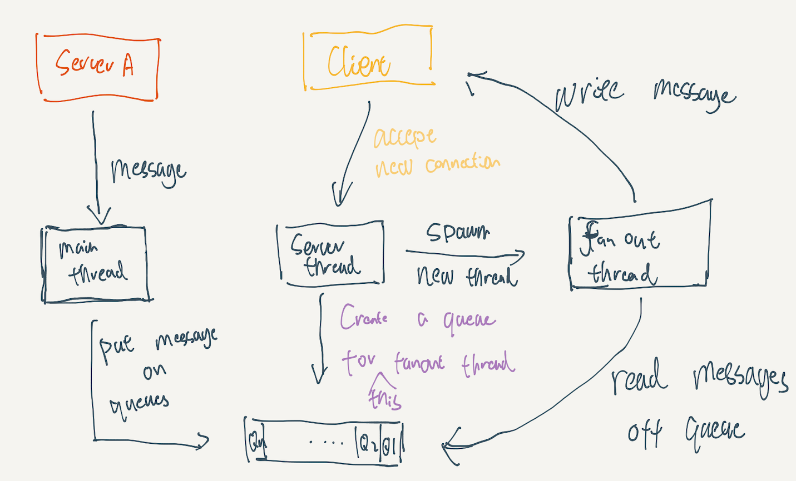

> TLDR: Without previous experience, I tried to write a TCP fanout server in 45 minutes, learning the APIs on the fly. Here is my experience and result.

I have _never_ worked with raw TCP socket API before. However, I know the concepts and have worked with various application-level protocols like HTTP and web sockets. As it happened, some friends challenged me to write a TCP fanout server in 45 minutes. The requirement is simple: I can choose any language and use Google to search for any documentation. The code does not need to be production-ready but should be well written. It felt like an interview, and I am glad to report that I survived to tell the lessons I learned from this little exercise.

The first step is understanding the task. We have a server. Let’s call it server A. The server will continuously send out fixed-length messages to the client, but it can only support one client. Your job is to write a program that reads from this server and broadcast the messages you got to any clients of your server.


Server A has been implemented for you; you don’t need to worry about the client's code either. The only thing that needs to be implemented here is the fanout server.

Where do we start? We need to connect to server A to get the messages. That should be easy?

```python
def open_read_only_socket(remote_addresss, port):
    s = socket.socket(socket.AF_INET, socket.SOCK_STREAM)
    s.connect((remote_addresss, port))
    return s
```

Yes, I will use Python to crack it, and no, I don't remember the parameters I should use to create a TCP connection by heart. I need to look at the [official documentation](https://docs.python.org/3/howto/sockets.html) to know that I must use AF_INET and SOCK_STREAM for a TCP connection. Once we have an open connection, we might want to read the fixed-size message from server A.

```python
def read_1k_from_socket(socket):
    chunks = []
    bytes_recd = 0
    while bytes_recd < 1024:
        chunk = socket.recv(min(1024 - bytes_recd, 1024))
        if chunk == b'':
            raise RuntimeError("socket connection broken")
        chunks.append(chunk)
        bytes_recd = bytes_recd + len(chunk)
    message = b"".join(chunks)
    return message
```

So here, I hard code the message size to be 1k bytes, but you can easily modify the function to read a varying number of bytes. Notice that this function demonstrated that TCP is a low-level protocol. Unlike HTTP, where you get the response in whole automatically, you need to manually manipulate the raw bytes coming from the wire to form the message.

Okay, now we are ready to read from server A. Let's put everything in a function called `server`:

```python
def server(a_address: str, a_port: int):
    try:
      a_socket = open_read_only_socket(a_address, a_port)
      while True:
          message = read_1k_from_socket(a_socket)
          print(message)
    except Exception as e:
        print("something horrible went wrong", e)
```

A little bit of manual testing showed that this code worked -- I see messages from server A printed to my stdout. Now, let's move on to the "sending the message to the clients" part. We need a server-side socket.

```python
def open_write_only_socket(port):
    s = socket.socket(socket.AF_INET, socket.SOCK_STREAM)
    s.bind(("localhost", port))
    s.listen(10)
    return s
```

Notice that the `bind` call will create a server-side socket, with which we can accept connections and write to the clients. The argument to listen seems a bit arbitrary. What does it mean? The official doc says:

> Finally, the argument to `listen` tells the socket library that we want it to queue up as many as five connect requests (the average max) before refusing outside connections. If the rest of the code is written correctly, that should be plenty.

This seems to suggest that it is several concurrent connections you can have. If you think so, you'd be wrong. As explained in this [StackOverflow post,](https://stackoverflow.com/a/2444491/1370639) it is the number of connections you have not yet accepted. As a rule of thumb, a server should try its best to accept connections as soon as possible. So if the rest of your code is correct, five should be more than enough, and ten is generous.

The next bit is a bit challenging. In theory, your program is always in a for loop, waiting for new messages from server A (see the code above). So how does it accept new clients?

"How do I do two things at the same time?" I asked myself...

Threads! We need a dedicated thread to accept any new clients' connections. We need to start the thread before the while loop:

```python
def server(a_address: str, a_port: int, server_port: int):
    try:
        a_socket = open_read_only_socket(a_address, a_port)
        server_socket = open_write_only_socket(server_port)

        server_thread = Thread(target=run_server, args=(server_socket,))
        server_thread.start()
        print("started server")

        while True:
            message = read_1k_from_socket(a_socket)
            print(message)
    except Exception as e:
        print("something horrible went wrong", e)
```

Now we need to implement the function `run_server`. The first step is easy; we need to be able to accept new connections:

```python
def run_server(socket: socket.socket):
    print("running server on a seperate thread")
    while True:
        clientsocket, address = socket.accept()
        print("connected by", address)
```

`accept` is the API to get a new connection from a remote client. It returns two things: a socket you can use to write back to the client and the client's address. I don't think we need the second return value, except for printing it to the log.

Using the command-line tool [nc](https://tldr.ostera.io/nc), we can connect to the server:



Great! We know we reached a milestone where we can read messages off server A and accept client connections. The next step is to deliver the message to the clients. How do we do that? We have two problems to solve:

1. Remember that the message lives in the main thread (the `message` variable in the while loop), but the clients live in a separate thread. How should different threads communicate with each other?
2. Also, once we accept a client, we immediately throw its information away. The clientsocket variable is not stored anywhere, and if there is a new connection, it is overwritten immediately. So practically, we have no way of writing to the clients now.

I think some design is due. I kind of regret not doing this in the beginning, but here we go:



1. We already have the main thread; it reads messages off "server A".
2. We already have a server thread; it accepts connections from clients.
3. We need the server thread to create a new fan-out thread for each client, and that thread will write messages from server A back to the client.
4. Now for problem 1: we need a global shared-memory data structure: a queue; each fan-out thread will have a separate queue and the main thread will put the new messages to the queues, waiting for the fan-out thread to process them.
5. For problem 2: when we start the fan-out thread, we can pass the socket information for each client to the fan-out thread, so it becomes local to that thread.

This may sound a little bit abstract; how about looking at some actual code:

```python

import socket
import queue
from threading import Thread, Lock

# Using a simple counter to assign each client a unique id
client_id = 0
# clients are global shared-memory queue, it is a dictionary
# because each client has its own queue, so its keys are the
# client id, and the values are the queue for each client
clients = {}

# We need to protect these shared variables when mutating them
client_lock = Lock()


def open_read_only_socket(remote_addresss, port):
    s = socket.socket(socket.AF_INET, socket.SOCK_STREAM)
    s.connect((remote_addresss, port))
    return s


def open_write_only_socket(port):
    s = socket.socket(socket.AF_INET, socket.SOCK_STREAM)
    s.bind(("localhost", port))
    s.listen(10)
    return s

def run_server(socket: socket.socket):
    global client_id, clients
    print("running server on a seperate thread")
    while True:
        clientsocket, address = socket.accept()
        print("connected by", address)

        with client_lock:
            # Create a new queue for this client
            clients[client_id] = queue.Queue()

            # Start the fanout thread for this client
            client_thread = Thread(target=fan_out_thread,
                                   args=(client_id, clientsocket))
            client_thread.start()
            # Increment the id so next client will have a new id
            client_id += 1

def fan_out_thread(idx, socket):
    while True:
        try:
            # Read from the queue
            q = clients[idx]
            message = q.get()
            # Send it to the client
            socket.sendall(message)
        except InterruptedError:
            # If this client has disconnected, remove this client from
            # memory so we claim back some resources
            del clients[idx]


def read_1k_from_socket(socket):
    chunks = []
    bytes_recd = 0
    while bytes_recd < 1024:

        chunk = socket.recv(min(1024 - bytes_recd, 1024))
        if chunk == b'':
            raise RuntimeError("socket connection broken")
        chunks.append(chunk)
        bytes_recd = bytes_recd + len(chunk)
    message = b"".join(chunks)
    return message


def server(a_address: str, a_port: int, server_port: int):
    try:
        a_socket = open_read_only_socket(a_address, a_port)
        server_socket = open_write_only_socket(server_port)

        server_thread = Thread(target=run_server, args=(server_socket,))
        server_thread.start()
        print("started server")

        while True:
            message = read_1k_from_socket(a_socket)
            # Putting the messages on the queue for fanout thread to process
            for i in clients.keys():
                client = clients[i]
                client.put(message)
    except TimeoutError:
        raise
    except InterruptedError:
        raise
    except Exception as e:
        print("something horrible went wrong", e)


server("localhost", 1234, 1235)

```

So this is what I come up with in 45 mins while designing on the fly and actively googling to learn how to use Python's TCP API. I am not satisfied though, there are a few directions I want to further explore:

- How do we make this production-ready? There must be corner cases I have not thought about, exceptions I have not handled, and failure scenarios I have not faced before. How can I make this code more robust?
- How to measure the performance of this server? What metrics should I use?
- How about async? Can I make use of `asyncio`? Will it perform better or worse?
- The Amazing David Beazley has a [talk](https://www.youtube.com/watch?v=Y4Gt3Xjd7G8) about building your own async with raw Python API, can I use his idea to help me here?
- I used shared-memory communication, but maybe we can try using `golang` to rewrite this and only rely on message-passing?
- How about C++? how about it's new async/await support?

All these questions are the reason why this post is called `etude 1`, I want to use this little task as a gateway to learning more about networking and system programming, to understand how to best write I/O code in different languages. So expect more like these to come!


