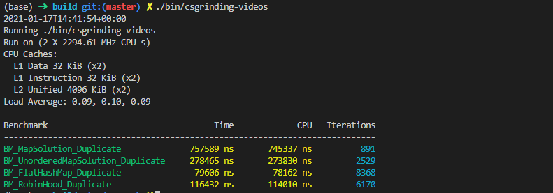
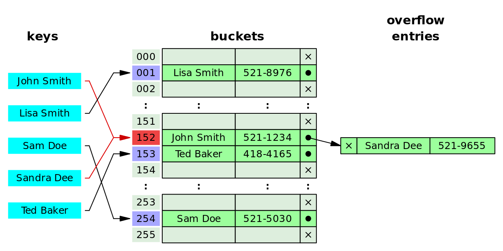
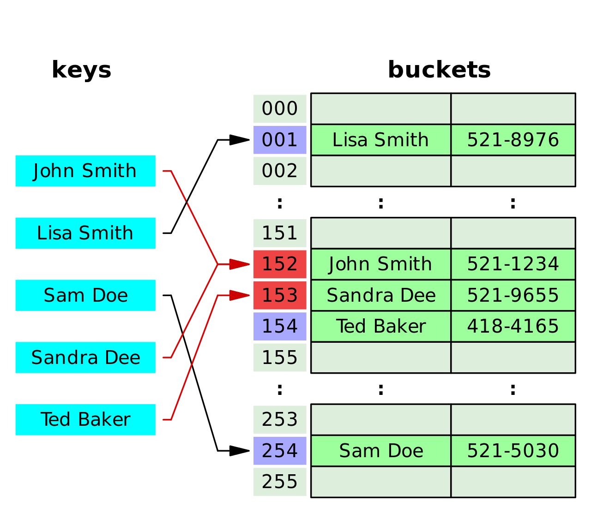

注：这只是我视频内容的底稿，有些细节只在视频内容里呈现了，所以有不清楚的地方请先看视频！

[Youtube Link](https://www.youtube.com/watch?v=nx5g5bwtUuA&list=PLG5eLZDYqpy2B9W8kVrbGSkL2lKmZ655a&index=3)

大家好，欢迎来到 Let’s C++的第三期，在这一起里我想和大家探讨一下关于 STL 里面的一个著名的容器类，std::unordered_map 的性能问题。

## std::unodred_map 也会有性能问题？

很多小伙伴都知道，我们一般不推荐大家使用 std::map，这是因为 std::map 会自动把你插入的元素按照他们的键值排序，为了实现这样的 interface(interface 有好的中文翻译么?)，一般的 C++实现会用红黑树或者 avl 树这样的自平衡二叉树。这样的话每次插入新的元素，查找元素和删除元素的操作都是 O(logn),所以从原理上讲 std::map 就是比较慢的。所以当我们需要一个类似 python 里的 dictionary 的数据结构时，我们一般会使用 std::unordered_map，std::unordered_mpa 和 python 里的 dictionary 一样，都可以理解为一个哈希表的具体实现。它的插入，查找，删除都是 O(1)的，比 std::map 好了不少。

那么，std::unordered_map 已经用上了理论上讲操作最优的实现，为什么我们还在谈它的性能问题呢？

我曾在一家 hedge fund 工作，当时在我们内部的代码库中用 C++实现了一个像 Python Pandas 一样的 dataframe 类，我在这个 hedge fund 的第一个 project 就是为这个 C++ dataframe 做性能调优。在这个 dataframe 内部我们保存数据时用到的就是 std::unordered_map。也就是在我做性能调优的过程中通过不断地 profiling 发现很多 dataframe 的瓶颈其实是在 std::unordered_map。

给大家举个例子，我们参考这个简单的面试题：给你一个整数 vector，请你返回一个 bool，告诉我这个 vector 里有没有重复的元素。

加入我们不考虑 hash_set 一个简单的实现可以写成这样：

```cpp
#include <unordered_map>

using namespace std;

class UnorderedMapSolution {
public:
  bool containsDuplicate(const vector<int> &nums) {
    unordered_map<int, int> m;
    for (auto i : nums) {
      m[i] += 1;
    }

    for (auto i : m) {
      if (i.second > 1)
        return true;
    }

    return false;
  }
};

```

这里的 unordered_map 其实可以替换成任何一个 hash table 的实现，包括我们刚刚谈到的 std::map。不久前 google 开源了他们内部的 abesil flat hash map 类，这也是一个 hash table，我在网上还找到了一些 C++爱好者的作品，那么我们可以看一下他们之间的对比。



我们可以看到，同样的算法，如果我们用 std::map 比 std::unordered_map 大约慢了三倍，然而如果我们用 Google 的实现，那么他们比 STL 又快了 3 倍，就连社区里的爱好者自己写的，也比 clang/gcc 这些“久经考验”的开源库自带的 C++ STL 实现快，那么这是为什么呢？

## hash table 的实现

在我们的算法和数据结构的课程里我们一般会介绍下面这样的一种哈希表的实现，每个哈希表都是一个定长的数组，每个 key 可以用一个 hash function 被影射到这个数组中的一个 cell，每个 cell 其实包含了一个链表。



当我们插入一个元素的时候，我们会根据它的 key 算出相对的哈希值，如果两个元素的哈希值是相同的，那么我们就会把后插入的元素加入在它哈希值对应的那个链表的最后。这种处理哈希碰撞的办法我们一般叫做 open hashing，或者叫做 closed addressing。

但是我们其实还有另一种处理哈希碰撞的办法，与 open hashing 相对应，可以叫做 closed hashing，也可以叫做 open addressing。



在两个元素的哈希值相同时，与其我们把后插入的这个元素放在一个链表中，我们可以把这个元素放在哈希表本来就有的这个数组当中，只要我们能够找到一个还没有被使用的 cell，那么我们就可以把后插入的元素放在这个空的 cell 当中。至于怎么找这个 cell，一般使用的办法有三种：

- linear probing: h(x, k+1) = a \* h(x, k) + c
- qudatic probing: h(x, k+1) = a _ h(x, k) ^ 2 + b _ h(x, k) + c
- double hash probing: h(x, k+1) = h(h(x, k))

这里 k 代表我们调用这个哈希函数的次数。如果一个元素在第一次哈希之后的 cell 不是空的，那么我们就用上面的 probing 技巧为这个元素再找一个新的 cell。

最简单的 linear probing function 可以是 h(x, k+1) = h(x, k) + 1。

大家可以猜一下：Google 的实现用了那种哈希碰撞的解决办法？

答案是第二种，也就是我们说的 open addressing，而且 Google 用的就是最简单的 linear probing。那么为什么这样写出来的哈希表比较快呢？给大家一点提示-->从硬件的角度考虑考虑？

答案是缓存，我们都知道如果我们的程序如果是顺序处理连续的内存，那么 CPU 会把我们正在处理的内存附近的内容读到他自己的缓存当中，下次如果 CPU 需要处理已经在缓存中的内容时，它就不需要从系统的主存重新读取相同的内容。

因为 Google 的哈希表用没有使用链表，而是采用了 open addressing+用一个 array 保存所有的键值对的方案，所以它的 performance 才远好于使用了传统的基于链表的实现。

那么 std::unordered_map 是不是可以改成这种实现呢？答案是暂时不行：如果我们看 STL 的文档，那么我们会发现 unordered_map 把它内部试用 buckets+linked list 的细节也暴露在了它的 API 当中。

> > Hyrum's Law:
> > With a sufficent number of users of an API, it does not matter what you promise in the contract, all observable behaviors of you syhstem will be depended on by somebody

# 问题

那么 Google flat_hash_map 是不是没有缺点呢？Pointer Invalidation。提一句。

# 更深一点

对我们普通程序员了解这些有什么用呢：

- junior: cache matters! use continous data structure if possible
- senior: open source matters! without open source what can we do?
- all: API design matters, the reason to have an API is to hide implemntation details!

# Fun fact

At every moment:

- 1% cpu is consumed by a C++ hash table
- 4% RAM is consumed by a C++ hash table


# Reference

- https://www.youtube.com/watch?v=ncHmEUmJZf4&t=1583s
- https://www.youtube.com/watch?v=fHNmRkzxHWs&t=3255s
